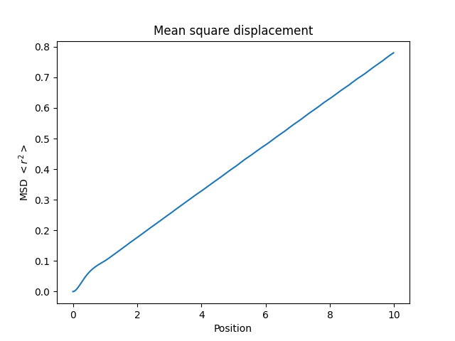

# Q1
Second derivative of $U(x)$ should be continuous:
$B = 2\pi^2$

# Q2
## Expectations 
As long as the discussion makes sense. 

1. NVE: Like a circle. 

2. Andersen thermostat: Canonical distribution. 
 
3. Nose-Hoover chain: Canonical distribution. Note that the third figure below shows the Nose-Hoover thermostat. 

4. Monte Carlo: $P(U)$ is proportional to $exp[βU(x)]$.

## Results from simulations

# Q3. Codes
1. (a) Velocities are not sampled. (b) MC can perform unphysical moves and sample regions that would be inaccessible with MD at the same temperature. 

2. At low and high temperatures the Hamiltonian (Energy) can be approximated by $E=\frac{1}{2}mv^2 + \frac{1}{2}\epsilon \pi^2 x^2$, which is the equation for an ellipse when E is constant. In the v(t), x(t)-plot this is a closed graph. At temperatures near the barrier height this will break down.

3. In principle the chain has to be infinite.

# Q4. Cross the barrier

Run the program at different temperatures. $T > (0.2-0.25)$

# Q5. Berendsen thermostat

Run the program with and without the stochastic term. 

# Q6. Periodic potential energy
Change the code `force.c`.

## Diffusion coefficient as a function of T

At low temperatures (with respect to the barriers in the potential energy surface) the system is confined to one of the local energy minima most of the time. The diffusion is governed by a hopping dynamics, where the hopping over the barriers is a rare event using normal molecular dynamics. 

## Collision frequency

The Andersen thermostat adds a stochastic component to the inertial dynamics of the system. The higher the Andersen thermostat collision frequency the more the dynamics of the system will behave in a stochastic manner.

