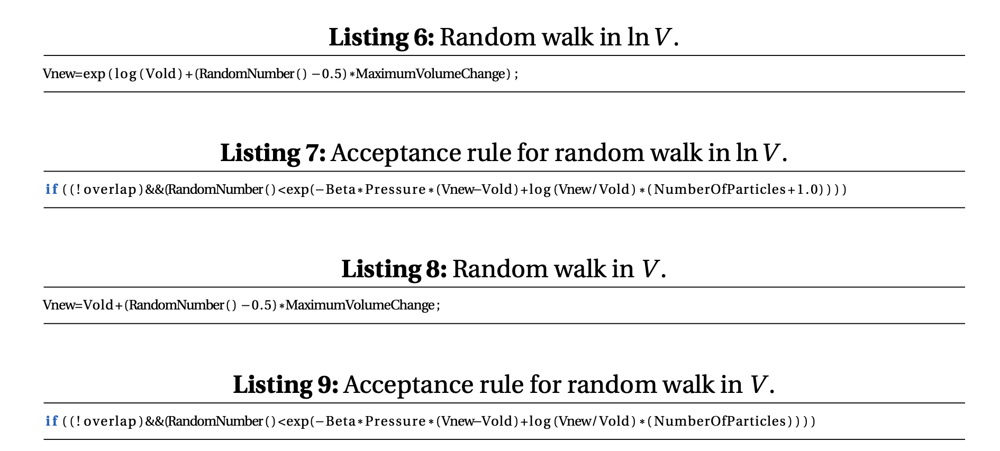
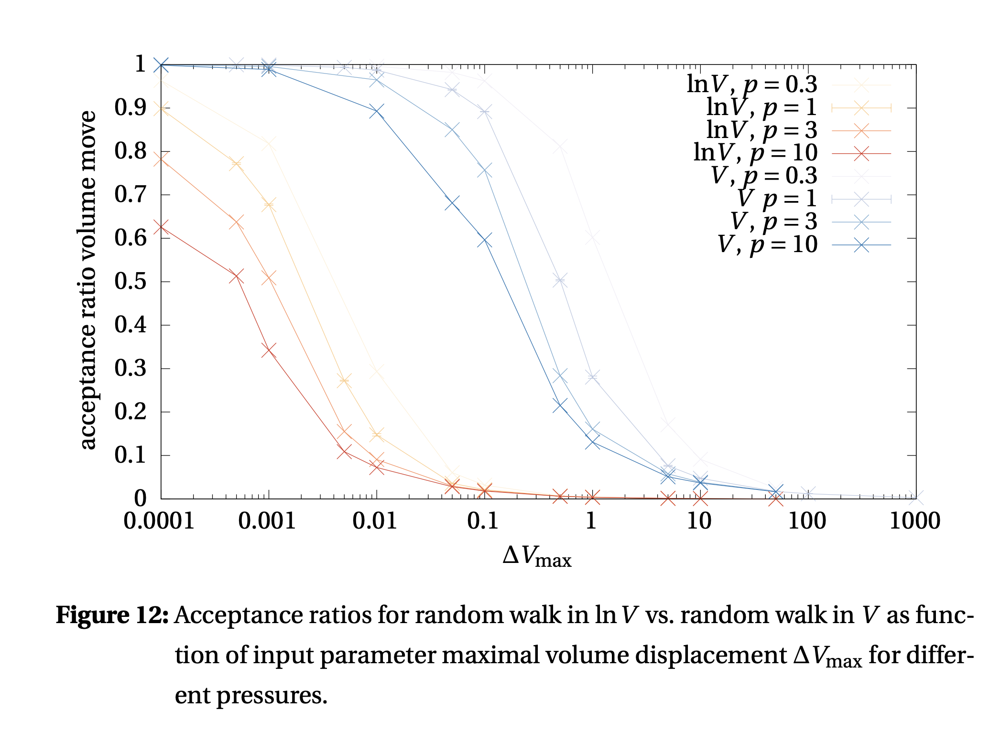

# Ex 2
The pressure of system can be calculated by the following
$$
\begin{gathered}
P=\frac{\rho}{\beta}+\frac{v i r}{3 V} \\
v i r=-r \cdot \frac{d U(r)}{d r}
\end{gathered}
$$

This formula can be found in block 2 ex 2

with the ideal gas in the volume $V_0-V$. For a infinitely large ideal gas reservoir, we have built a barostat in that way with the combined partition function
$$
Q(N, p, T)=\frac{\beta p}{\Lambda^{3 N} N!} \int \mathrm{d} V V^N \exp (-\beta p V) \int \mathrm{d} \mathbf{s}^N \exp \left[-\beta U\left(\mathbf{s}^N, L\right)\right],
$$
where we recognized that in the limit $V / V_0 \rightarrow 0$ we can write the expression $\left(V_0-\right.$ $V)^{M-N}$ with the exponential $\exp (-\rho V) \cdot{ }^{[11]}$ We then find that the probability density is proportional to
$$
p\left(V ; \mathbf{s}^N\right) \propto V^N \exp [-\beta p V] \exp \left[-\beta E\left(\mathbf{s}^N, V\right)\right],
$$
which then gives rise to an acceptance ratio of
$$
\begin{aligned}
\frac{\operatorname{acc}(o \rightarrow n)}{\operatorname{acc}(n \rightarrow o)} & =\frac{\exp \left[-\beta\left(E\left(\mathbf{s}^N ; V^{\prime}\right)+p V^{\prime}-N \beta^{-1} \ln V^{\prime}\right)\right]}{\exp \left[-\beta\left(E\left(\mathbf{s}^N ; V\right)+p V-N \beta^{-1} \ln V\right)\right]} \\
& =\exp \left[-\beta\left(E\left(\mathbf{s}^N, V^{\prime}\right)-E\left(\mathbf{s}^N, V\right)+P\left(V^{\prime}-V\right)-N \beta^{-1} \ln \left(\frac{V^{\prime}}{V}\right)\right)\right]
\end{aligned}
$$
for changes of the volume.

## Question 1

In the case of hard spheres, the potential is discontinuous (cp. eq. 10), wherefore it is not possible to evaluate the pressure using the “classical” virial equation which contains the derivative of the potential. Nevertheless, it might be calculated using e. g. a cavity distribution function

## Question 2

We find an average density of 0.455 ± 0.006 for three runs in V and a density of 0.469 ± 7.000 for three runs (similar conditions, i. e. 5000 steps, 500 initialization cy- cles, 100 particles, a maximal displacement of 0.01 and a maximal volume change of 1 at β = 10 and p = 1) in ln V , which shows that our implementation works correctly.

## Question 3

As we can see here quite clearly the acceptance rate for the lnV scheme looks much lower at large
displacements, but this may not be a disadvantage. Because in fact, if you take a displacement in the
lnV scheme, the actual Volume coverage may be much bigger, meaning that for systems with high
pressure changes (such as phase transitions between gas and liquid states), the linear displacement
scheme may simply be inefficient whereas the lnV scheme allows to cover that volume space faster.
As a side note, it must be mentioned, that running lnV calculations went faster usually making it more
appealing, however, there is no final consensus in literature as of which algorithm is superior.

